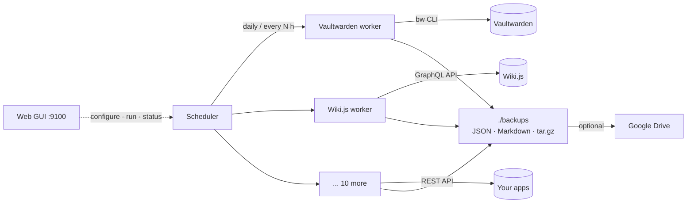

<picture>
  <source media="(prefers-color-scheme: dark)" srcset="docs/assets/header-dark.svg" />
  
</picture>

<p align="center">
  <a href="https://github.com/alws34/homelab-takeout/actions/workflows/ci.yml"></a>
  
  <a href="LICENSE"></a>
  
  <a href="https://github.com/alws34/homelab-takeout/commits/main"></a>
</p>

<p align="center">
  <b>Scheduled, readable exports of your self-hosted apps, taken through each app's own API.</b><br />
  No database credentials. No <code>docker.sock</code>. No <code>docker exec</code>. Just the JSON and Markdown the app itself hands you.
</p>

<p align="center">
  <a href="#quick-start">Quick start</a> ·
  <a href="#supported-services">Services</a> ·
  <a href="#how-it-works">How it works</a> ·
  <a href="#what-this-is-not">What this is not</a> ·
  <a href="#contributing">Contributing</a>
</p>

<p align="center">
  
</p>

## Why

A database dump captures everything an app stores, including logs, caches and
internal state, in a format tied to that app's schema version. Homelab Takeout
captures *your data* instead: it presses each app's "export" button for you on
a schedule and ships the result somewhere safe.

- **Readable backups.** Plain JSON and Markdown you can `grep`, diff, and open in
  ten years, not a `pg_dump` tied to the schema version you happened to run.
- **Least privilege.** Each worker uses a scoped API key, the same access an
  ordinary client gets. Nothing touches databases, volumes, or the Docker socket.
- **Version-tolerant.** Exports come from the app's public API, so they survive
  app upgrades better than raw database files.
- **Small.** You get Immich's metadata, not 400 GB of photos again every night.
- **Configured from the browser.** Credentials, schedule, retention, and
  destinations are all editable in the web GUI. No YAML to hand-edit.

## Features

- 12 services supported out of the box, each a single small Python file
- Daily at a fixed time, or every *N* hours, plus **Run now** and **Run all**
- Local retention (default: 30 days) and Google Drive retention (default: last 3)
- Optional upload to **Google Drive** after every successful run
- Per-service status, last result, and logs in the GUI
- Secrets live only in a `chmod 600` `.env` and are redacted from logs
- Built from source on your own machine, so you know exactly what's running

## Supported Services

| Service | What's exported | Restore |
|---|---|---|
| [Vaultwarden](docs/services/vaultwarden.md) | Full vault, encrypted with its own password (via the official `bw` CLI) | ✅ Native import |
| [Linkwarden](docs/services/linkwarden.md) | Links and collections (Linkwarden's own migration format) | ✅ Native import |
| [n8n](docs/services/n8n.md) | Workflows, tags, variables | ✅ `n8n import:workflow` |
| [Wiki.js](docs/services/wikijs.md) | Every page as Markdown/HTML, by path | 🟡 Disk import, content only |
| [Snipe-IT](docs/services/snipeit.md) | Assets, licenses, accessories, users, locations, custom fields | 📄 Reference |
| [Bar Assistant](docs/services/bar-assistant.md) | Cocktails, ingredients, glasses, tags, collections (per bar) | 📄 Reference |
| [KitchenOwl](docs/services/kitchenowl.md) | Households, recipes, items, shopping lists | 📄 Reference |
| [Karakeep](docs/services/karakeep.md) | Bookmarks with content, lists, tags, highlights | 📄 Reference |
| [Spoolman](docs/services/spoolman.md) | Spools (incl. archived), filaments, vendors, settings | 📄 Reference |
| [Immich](docs/services/immich.md) | Metadata only: albums, people, tags, EXIF (not media files) | 📄 Reference |
| [Nginx Proxy Manager](docs/services/nginx-proxy-manager.md) | Hosts, streams, access lists, cert metadata, settings | 📄 Reference |
| [AdGuard Home](docs/services/adguard-home.md) | DNS settings, filters, rewrites, clients, DHCP/TLS config | 📄 Reference |

**Restore legend:** ✅ the app's own import takes the file. 🟡 imports with
caveats. 📄 a complete, readable record you rebuild from; there's no one-click
import yet. Each guide has a **Restoring** section with the exact steps.

**Destination:** [Google Drive](docs/services/google-drive.md). Missing your
app? [Open an issue](https://github.com/alws34/homelab-takeout/issues), or
[add a worker](#adding-a-service) (often under 100 lines).

## Quick Start

```bash
git clone https://github.com/alws34/homelab-takeout.git && cd homelab-takeout
cp .env.example .env && chmod 600 .env
mkdir -p backups logs state && chmod 700 backups logs state

docker compose up -d --build
```

Open **http://&lt;your-host&gt;:9100**, click **Configure** on a service, paste
its URL and API key, and hit **Run now**. Backups land in `./backups/<service>/`.

There's no prebuilt image on purpose: you build from the code you just cloned.
To update, `git pull` and run the same `docker compose up -d --build`.
The timezone defaults to UTC; set `TZ=Europe/Berlin` (or similar) in `.env`.

### Run without Docker (systemd)

On any Linux with systemd and Python 3.12+ (plus `python3-venv` on Debian/Ubuntu):

```bash
git clone https://github.com/alws34/homelab-takeout.git && cd homelab-takeout
sudo ./scripts/install.sh                   # add --with-bitwarden for Vaultwarden (needs Node.js + npm)
```

It runs as its own `homelab-takeout` user in a sandboxed unit
(`systemd-analyze security homelab-takeout` rates it 1.1, "OK"), and the GUI is on port 9100.

| What | Where |
|---|---|
| Code + virtualenv | `/opt/homelab-takeout` |
| Config (`services.json`, `.env`, Google credentials) | `/etc/homelab-takeout` |
| Backups and state | `/var/lib/homelab-takeout` |
| Logs | `journalctl -u homelab-takeout -f` |

To update, `git pull && sudo ./scripts/install.sh --upgrade`. To remove it, run
`sudo ./scripts/install.sh --uninstall` (keeps config and backups), or add `--purge` to delete
everything.

## How It Works



Each service has a **worker**: a small class that authenticates with the app's
API, pulls everything that user can see, and writes it to a timestamped file.
The scheduler runs enabled workers, records the result, applies retention, and
hands successful files to the destination. See
[`architecture.md`](architecture.md) for details.

## What This Is Not

The design choice draws fair questions, so here are the answers up front.

**It's not a disaster-recovery image.** It doesn't snapshot volumes, databases,
compose files, or logs. If you want to put a dead server back *exactly* as it
was, use volume or filesystem backups: [restic](https://restic.net/),
[Borg](https://www.borgbackup.org/), ZFS snapshots, or DB dumps plus `rsync`.

**It works alongside those, not instead of them.** Volume backups give you the
exact server state but tie you to that app's schema version and storage layout.
API exports give you *your data* in a portable format that survives upgrades,
migrations, and "I'll rebuild this box from scratch". Many people run both.

| | Volume / DB dumps | Homelab Takeout |
|---|---|---|
| Exact 1:1 server state | ✅ | ❌ |
| Human-readable output | ❌ | ✅ |
| Needs DB credentials or `docker.sock` | Usually | Never |
| Survives app version upgrades | Sometimes | Usually |
| Includes logs, caches, media | ✅ | ❌ (by design) |
| Restore | Copy files back | App import, or rebuild from the record |

**It doesn't restore for you (yet).** Where an app has a native import, the
guides show how to use it. A restore helper for the 📄 services is on the roadmap.

## Security

- Secrets live only in `.env` (enforced `chmod 600`) and are redacted from logs
- Backup files are written `chmod 600`; the Vaultwarden export is encrypted
- No Docker socket, no DB access, no telemetry, and no outbound calls except
  to your own apps and (optionally) Google Drive
- **The web GUI has no built-in authentication.** Keep it on your LAN, or put it
  behind an auth proxy (Authelia, Authentik, Traefik forward-auth, nginx basic auth)

Full threat model: [`security.md`](security.md).

## Adding a Service

1. Create `app/workers/<name>.py` inheriting `BackupWorker`
2. Set `worker_type`, `display_name`, `description`, `env_var_specs`
3. Implement `run(context) -> BackupResult`. Most workers just call `fetch_json()`
   and `archive_json()` from the base class
4. Register it in `app/core/registry.py → create_default_registry()`
5. Add an entry to `config/services.json` and a guide under `docs/services/`

The GUI picks up new workers automatically. [`app/workers/spoolman.py`](app/workers/spoolman.py)
is a complete 48-line example.

## Contributing

Issues and PRs are welcome, especially new workers and restore helpers.
Every PR runs `ruff` and the test suite in CI:

```bash
pip install -r requirements.txt pytest ruff
ruff check app tests && ruff format --check app tests
PYTHONPATH=. pytest tests -q
```

Dependencies are pinned with [pip-tools](https://pip-tools.readthedocs.io/):
edit `requirements.in`, then run `pip-compile requirements.in -o requirements.txt`.
The Bitwarden CLI version is pinned via `ARG BW_CLI_VERSION` in the `Dockerfile`.

### How this was built

The architecture and design decisions are mine. Much of the implementation was
written with an AI coding assistant, then reviewed, tested against live
instances of every supported app, and covered by the test suite. I maintain it
and review every PR.

## License

[MIT](LICENSE)
