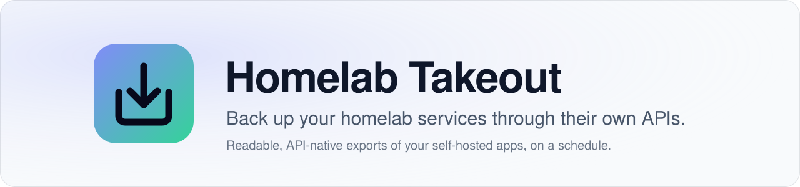
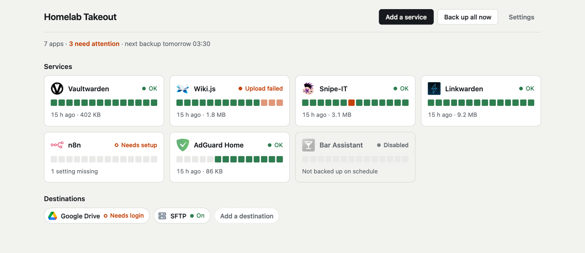
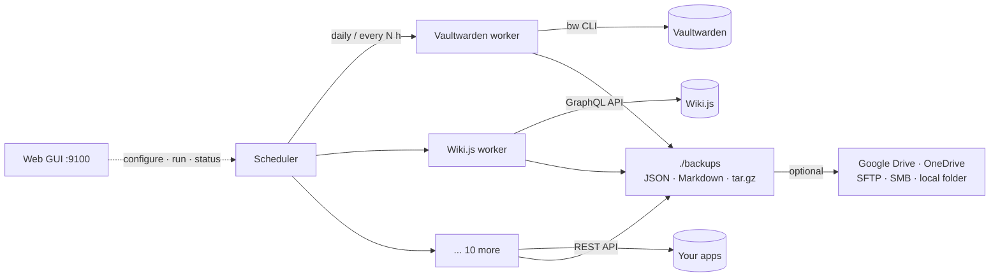

<picture>
  <source media="(prefers-color-scheme: dark)" srcset="docs/assets/header-dark.svg" />
  
</picture>

<p align="center">
  <a href="https://github.com/alws34/homelab-takeout/actions/workflows/ci.yml"></a>
  
  <a href="LICENSE"></a>
  
  <a href="https://github.com/alws34/homelab-takeout/commits/main"></a>
</p>

<p align="center">
  <b>Scheduled, readable exports of your self-hosted apps, taken through each app's own API.</b><br />
  No database credentials. No <code>docker.sock</code>. No <code>docker exec</code>. Just the JSON and Markdown the app itself hands you.
</p>

<p align="center">
  <a href="#quick-start">Quick start</a> ·
  <a href="#supported-services">Services</a> ·
  <a href="#how-it-works">How it works</a> ·
  <a href="#what-this-is-not">What this is not</a> ·
  <a href="#contributing">Contributing</a>
</p>

<p align="center">
  
</p>

## Why

A database dump captures everything an app stores, including logs, caches and
internal state, in a format tied to that app's schema version. Homelab Takeout
captures *your data* instead: it presses each app's "export" button for you on
a schedule and ships the result somewhere safe.

- **Readable backups.** Plain JSON and Markdown you can `grep`, diff, and open in
  ten years, not a `pg_dump` tied to the schema version you happened to run.
- **Least privilege.** Each worker uses a scoped API key, the same access an
  ordinary client gets. Nothing touches databases, volumes, or the Docker socket.
- **Version-tolerant.** Exports come from the app's public API, so they survive
  app upgrades better than raw database files.
- **Small.** You get Immich's metadata, not 400 GB of photos again every night.
- **Configured from the browser.** Credentials, schedule, retention, and
  destinations are all editable in the web GUI. No YAML to hand-edit.

## Features

- 12 services supported out of the box, each a single small Python file
- Daily at a fixed time, or every *N* hours, plus **Back up now** for one app or all
- Local retention (default: 30 days) and per-destination retention (default: last 3)
- Copies to **Google Drive, OneDrive, SFTP, SMB** or any local folder after every run
- Add only the apps you run; each shows OK, failed or needs setup at a glance
- Secrets live only in a `chmod 600` `.env` and are redacted from logs
- Built from source on your own machine, so you know exactly what's running

## Supported Services

| Service | What's exported | Restore |
|---|---|---|
| [Vaultwarden](docs/services/vaultwarden.md) | Full vault, encrypted with its own password (via the official `bw` CLI) | ✅ Native import |
| [Linkwarden](docs/services/linkwarden.md) | Links and collections (Linkwarden's own migration format) | ✅ Native import |
| [n8n](docs/services/n8n.md) | Workflows, tags, variables | ✅ `n8n import:workflow` |
| [Wiki.js](docs/services/wikijs.md) | Every page as Markdown/HTML, by path | 🟡 Disk import, content only |
| [Snipe-IT](docs/services/snipeit.md) | Assets, licenses, accessories, users, locations, custom fields | 📄 Reference |
| [Bar Assistant](docs/services/bar-assistant.md) | Cocktails, ingredients, glasses, tags, collections (per bar) | 📄 Reference |
| [KitchenOwl](docs/services/kitchenowl.md) | Households, recipes, items, shopping lists | 📄 Reference |
| [Karakeep](docs/services/karakeep.md) | Bookmarks with content, lists, tags, highlights | 📄 Reference |
| [Spoolman](docs/services/spoolman.md) | Spools (incl. archived), filaments, vendors, settings | 📄 Reference |
| [Immich](docs/services/immich.md) | Metadata only: albums, people, tags, EXIF (not media files) | 📄 Reference |
| [Nginx Proxy Manager](docs/services/nginx-proxy-manager.md) | Hosts, streams, access lists, cert metadata, settings | 📄 Reference |
| [AdGuard Home](docs/services/adguard-home.md) | DNS settings, filters, rewrites, clients, DHCP/TLS config | 📄 Reference |

**Restore legend:** ✅ the app's own import takes the file. 🟡 imports with
caveats. 📄 a complete, readable record you rebuild from; there's no one-click
import yet. Each guide has a **Restoring** section with the exact steps.

## Destinations

Every successful backup is copied to the destinations you switch on, keeping
the newest copies per service (3 by default). Files you put there yourself are
never deleted.

| Destination | How you connect |
|---|---|
| [Google Drive](docs/destinations/google-drive.md) | **Log in with Google**: enter a short code at google.com/device on any device |
| [OneDrive](docs/destinations/onedrive.md) | **Log in with Microsoft**: same code-on-your-phone sign-in |
| [SFTP](docs/destinations/sftp.md) | Host + password or SSH key; host key pinned on first connect |
| [SMB share](docs/destinations/smb.md) | Server, share, user, password; SMB3 encrypted |
| [Local folder](docs/destinations/local-folder.md) | Any path: NAS mount, rclone mount, Syncthing folder |

Logins stay connected and refresh their tokens by themselves. The cloud apps
can only see the folder they created, never the rest of your Drive or OneDrive.

Missing your
app? [Open an issue](https://github.com/alws34/homelab-takeout/issues), or
[add a worker](#adding-a-service) (often under 100 lines).

## Quick Start

```bash
git clone https://github.com/alws34/homelab-takeout.git && cd homelab-takeout
cp .env.example .env && chmod 600 .env
mkdir -p backups logs state && chmod 700 backups logs state

docker compose up -d --build
```

Open **http://&lt;your-host&gt;:9100** and create the admin password with the setup
code from `docker logs homelab-takeout`. Click **+ Add a service**, pick your apps,
fill in each one's URL and API key, and hit **Back up now**. Backups land in
`./backups/<service>/`.

There's no prebuilt image on purpose: you build from the code you just cloned.
To update, `git pull` and run the same `docker compose up -d --build`.
The timezone defaults to UTC; set `TZ=Europe/Berlin` (or similar) in `.env`.

The container runs as an unprivileged user, uid:gid `1000:1000` by default. If
your files belong to a different user (check with `id -u` / `id -g`), set
`PUID` and `PGID` in `.env`. Tagged releases are signed; see
[Verifying releases](docs/VERIFYING_RELEASES.md) to check one before building it.

### Upgrading from a root container

Versions before the non-root change ran as root, so `backups/`, `logs/`, `state/`,
`config/` and `.env` may now contain root-owned files. The container checks this
at startup and, if it can't write somewhere, exits with a message naming the path.
Fix it once from the compose folder:

```bash
sudo chown -R 1000:1000 backups logs state config .env   # or your PUID:PGID
docker compose up -d --build
```

### Upgrading from a version that shipped `config/services.json`

`config/services.json` is no longer part of the repository; the app creates it on
first start. If `git pull` refuses because of your local changes to it, keep your
copy aside for the pull:

```bash
mv config/services.json config/services.json.mine
git pull
mv config/services.json.mine config/services.json
docker compose up -d --build
```

If the file is gone anyway, the app recreates it with every app whose settings are
already in `.env`; only the schedule and retention go back to their defaults.

### Run without Docker (systemd)

On any Linux with systemd and Python 3.12+ (plus `python3-venv` on Debian/Ubuntu):

```bash
git clone https://github.com/alws34/homelab-takeout.git && cd homelab-takeout
sudo ./scripts/install.sh                   # add --with-bitwarden for Vaultwarden (needs Node.js + npm)
```

It runs as its own `homelab-takeout` user in a sandboxed unit
(`systemd-analyze security homelab-takeout` rates it 1.1, "OK"), and the GUI is on port 9100.

| What | Where |
|---|---|
| Code + virtualenv | `/opt/homelab-takeout` |
| Config (`services.json`, `.env`, Google credentials) | `/etc/homelab-takeout` |
| Backups and state | `/var/lib/homelab-takeout` |
| Logs | `journalctl -u homelab-takeout -f` |

To update, `git pull && sudo ./scripts/install.sh --upgrade`. To remove it, run
`sudo ./scripts/install.sh --uninstall` (keeps config and backups), or add `--purge` to delete
everything.

## How It Works



Each service has a **worker**: a small class that authenticates with the app's
API, pulls everything that user can see, and writes it to a timestamped file.
The scheduler runs enabled workers, records the result, applies retention, and
hands successful files to the destination. See
[`architecture.md`](architecture.md) for details.

## What This Is Not

The design choice draws fair questions, so here are the answers up front.

**It's not a disaster-recovery image.** It doesn't snapshot volumes, databases,
compose files, or logs. If you want to put a dead server back *exactly* as it
was, use volume or filesystem backups: [restic](https://restic.net/),
[Borg](https://www.borgbackup.org/), ZFS snapshots, or DB dumps plus `rsync`.

**It works alongside those, not instead of them.** Volume backups give you the
exact server state but tie you to that app's schema version and storage layout.
API exports give you *your data* in a portable format that survives upgrades,
migrations, and "I'll rebuild this box from scratch". Many people run both.

| | Volume / DB dumps | Homelab Takeout |
|---|---|---|
| Exact 1:1 server state | ✅ | ❌ |
| Human-readable output | ❌ | ✅ |
| Needs DB credentials or `docker.sock` | Usually | Never |
| Survives app version upgrades | Sometimes | Usually |
| Includes logs, caches, media | ✅ | ❌ (by design) |
| Restore | Copy files back | App import, or rebuild from the record |

**It doesn't restore for you (yet).** Where an app has a native import, the
guides show how to use it. A restore helper for the 📄 services is on the roadmap.

## Security

- Secrets live only in `.env` (enforced `chmod 600`) and are redacted from logs
- Backup files are written `chmod 600`; the Vaultwarden export is encrypted
- No Docker socket, no DB access, no telemetry, and no outbound calls except
  to your own apps and the destinations you switch on
- The container runs non-root with all capabilities dropped, `no-new-privileges`
  and a read-only root filesystem; dependencies are hash-pinned
- Releases are signed with Sigstore and ship SLSA provenance and an SBOM
  ([how to verify](docs/VERIFYING_RELEASES.md))
- **The GUI asks for an admin password.** On first start the server prints a
  one-time setup code to its logs (`docker logs homelab-takeout`); only someone
  who can read those can create the password. Already run Authelia or
  Authentik? Switch to *My sign-in proxy* in Settings → Sign-in.
- The GUI also blocks DNS-rebinding and cross-site requests and escapes all data
  it displays. Still, keep it on your LAN or VPN rather than the open internet.

**Locked out?** Delete `state/auth.json` and restart: a new setup code appears in
the logs. If the proxy mode is misconfigured, set `AUTH_MODE=password` in `.env`
and restart.

Full threat model: [`docs/threat-model.md`](docs/threat-model.md). To report a vulnerability, see [`SECURITY.md`](SECURITY.md).

## Adding a Service

1. Create `app/workers/<name>.py` inheriting `BackupWorker`
2. Set `worker_type`, `display_name`, `description`, `env_var_specs`
3. Implement `run(context) -> BackupResult`. Most workers just call `fetch_json()`
   and `archive_json()` from the base class
4. Register it in `app/core/registry.py → create_default_registry()`
5. Add its logo as `app/api/static/icons/<worker_type>.svg`, from
   [dashboard-icons](https://github.com/homarr-labs/dashboard-icons)
6. Add a guide under `docs/services/` (the app shows up in the GUI's app picker)

The GUI picks up new workers automatically. [`app/workers/spoolman.py`](app/workers/spoolman.py)
is a complete 48-line example.

## Contributing

Issues and PRs are welcome, especially new workers and restore helpers. See
[`CONTRIBUTING.md`](CONTRIBUTING.md). Every PR runs `ruff`, the test suite, a
Docker build and smoke test, and CodeQL in CI:

```bash
pip install --require-hashes -r requirements.txt -r requirements-dev.txt
ruff check app tests && ruff format --check app tests
PYTHONPATH=. pytest tests -q
```

Dependencies are locked with hashes by [pip-tools](https://pip-tools.readthedocs.io/):
edit `requirements.in` (or `requirements-dev.in`), then run
`pip-compile --generate-hashes --strip-extras requirements.in -o requirements.txt`
(and the same for `requirements-dev`). The Bitwarden CLI version is pinned in
`bw/package.json`, with its dependencies locked in `bw/package-lock.json`.

### How this was built

The architecture and design decisions are mine. Much of the implementation was
written with an AI coding assistant, then reviewed, tested against live
instances of every supported app, and covered by the test suite. I maintain it
and review every PR.

## License

[MIT](LICENSE)
